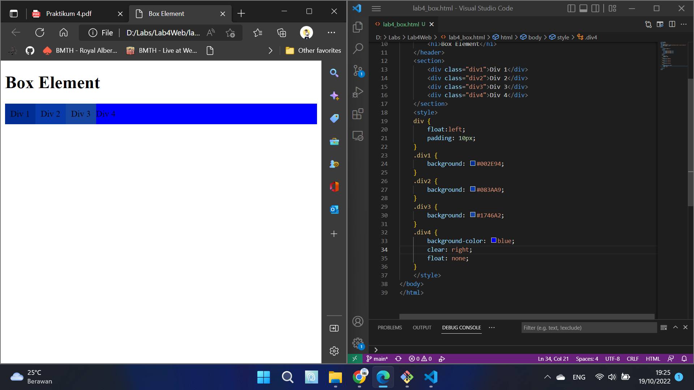
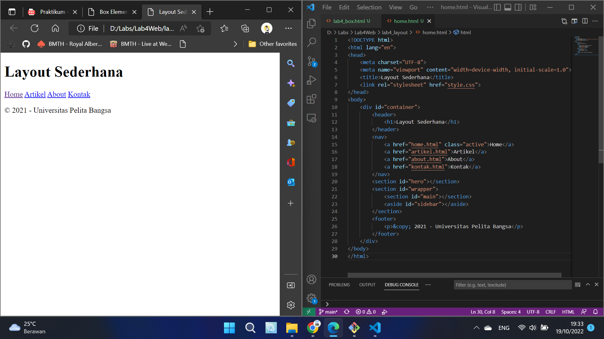

# Lab4Web
## Ananda Fachri Reynaldi
## 312110248
## TI.21.B1

### Membuat File HTML Box Element
1. Membuat Box Element

2. Mengatur Clearfix Element

3. Eksperimen Clearfix Element  
Memindahkan clear ke right

### Membuat File HTML Layout
4. Membuat folder baru dengan nama lab4_layout, membuat file baru di dalamnya dengan nama home.html
